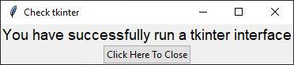

# Git and Python Set-up Verification
Students in BME 547 may use this repository as a test to make sure that they 
have successfully set-up their local git and Python.

1. Open up GitHub repository at <https://github.com/dward2/setup_verification>
2. Click on the green "Code" button.
3. In the Clone pop-up box, make sure that SSH is underlined.
4. Copy the URL from the pop-up box.  It should look something like:
`git@github.com:dward2/setup_verification.git`.
5. Open up a Git Bash, command window, or terminal window (will be called CLI,
command line interface, in further instructions).
6. Navigate, using the `cd` command, to a location where you would like to store
your repositories for this course.  (If unfamiliar with using the `cd`
command and making directories from the command line, please see the 
"Directories" section below for more information.)
7. Back on your CLI, type `git clone <URL>` where `<URL>` is the URL copied from
above.  Note, do not include the `<>`.  Hit return.
8. A new folder called `setup_verification` should have been created.  Move into
that directory by entering `cd setup_verification`.
9.  Test your ability to run Python by entering `python check_python.py`.  A
program should have run that printed out the Python version and said that you
successfully ran Python.
10.  Test your ability to set up a virtual environment by entering 
`python -m venv myvenv`.  Next, enter `ls` to verify that a new folder called
`myvenv` was created.  
11. Activate the virtual environment by entering:  
  + **MAC/Linux**:  `source myvenv/bin/activate`
  + **Windows**: `source myvenv/Scripts/activate`  
  
12. Verify that the virtual environment activated by seeing `(myvenv)` in the
command line.
13.  Test your ability to add packages using `pip` by entering 
`pip install -r requirements.txt`.
14. To run one of the newly installed packages, enter 
`jupyter notebook jupyter_nb_check.ipynb`.  A Jupyter notebook should open
in a browser window.  Follow the brief instructions in the Jupyter notebook.
15. When finished, return to the CLI.  If you do not have access to a command
prompt, you may need to type `ctrl-C` to cancel the Jupyter notebook server
that is running.
16. Deactivate your virtual environment by entering `deactivate`.

## Directories
#### Quick Start
* Right after you open Git Bash, type `mkdir BME547_repos` to make a new folder
for this class.
* Move into this folder by typing `cd BME547_repos`

For more details, keep reading.  Otherwise, go back to steps above.

#### Home directory  

When Git Bash is first started, you will start in what is called your home
directory.  The home directory is indicated by the `~` symbol on the command
line prompt.  If you want to see the full path for your home directory, enter
the `pwd` command.  Note that a "folder" and "directory" are the same in this
context and I will use the terms interchangeably.  

#### Creating a directory / folder
If you want to create a new folder within the current folder, you can use
the command `mkdir`.  For example:  `mkdir class_repos`.  

#### Listing directories/ folders and files
To see the files and folders in the current folder, enter the `ls` command.

#### Changing folders / directories
To move into a subfolder within the current folder, use the `cd` command.  For
example:  `cd class_repos`.

If you want to move back to the parent directory, type `cd ..`.
 
# TkInter Check
For the initial set-up at the beginning of the semester, this part can be
ignored.  Later in the semester, when we will be working on graphical user
interfaces, the `check_tkinter.py` file can be used to verify that you can
run the `tkinter` package of Python.

To check operation of `tkinter`:
* Open a GitBash or terminal window
* In the repository folder, enter the command `python check_tkinter.py`
* The following window should display:  
  
* If so, simply click the "Click Here To Close" button and you are good to go.
* If not, additional debugging will be needed.
